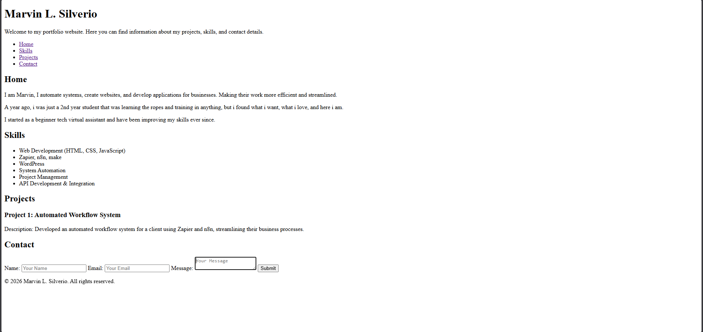
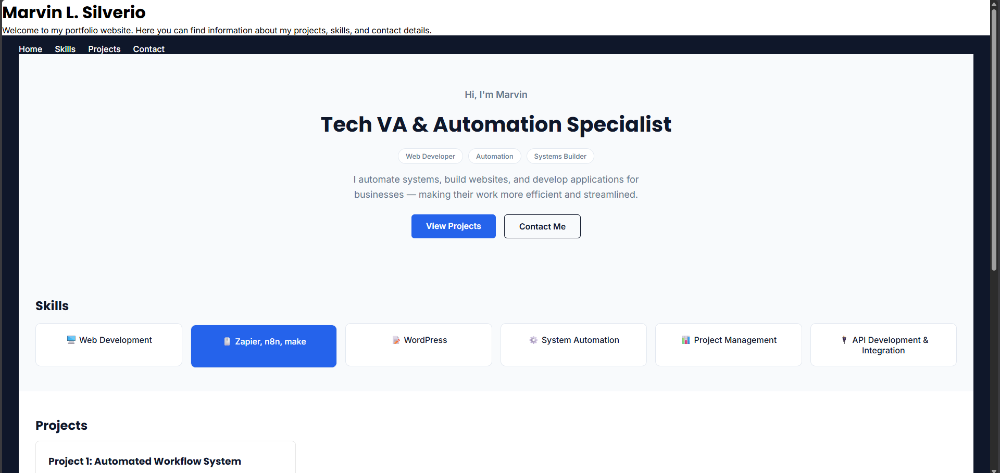

# Personal Developer Profile

## Overview
This is my personal portfolio website introducing myself, my skills, projects, and contact information.
Built starting from plain HTML, then progressively upgraded through multiple CSS revisions into a modern, professional-feeling site.
This project was built as part of my Tech VA Journey roadmap — Project 01.

---

## Technologies Used
- HTML5
- CSS3 (Flexbox, CSS Variables, Transitions, Google Fonts)

---

## Features
- Styled navigation menu with smooth scroll and hover states
- Modern hero section with tag badges and dual call-to-action buttons
- Skills section presented as interactive icon cards
- Projects section with a styled, animated project card
- Polished contact form with focus states
- Styled footer
- Custom typography using Google Fonts (Poppins + Inter)
- Refined, modern color palette

---

## Folder Structure

Project 01 - Personal Profile
├── index.html
├── style.css
├── README.md
└── screenshots
├── before.png
└── after.png

---

## Screenshots

### Before (HTML only)

### After (Fully styled, v3)

---

## What I Learned

**From the HTML phase:**
- Basic HTML document structure
- Headings, paragraphs, navigation links, lists, and forms
- Organizing a webpage into semantic sections

**From the CSS phase (v1 → v3):**
- Linking an external stylesheet and using CSS variables for consistent, easily-updatable theming
- The Box Model and spacing fundamentals
- Styling with classes over raw tags for scalability
- Flexbox for layout — navigation, skill cards, forms, and hero buttons
- Hover and focus states for interactivity and accessibility
- Building reusable components (project cards, button variants using base + modifier classes)
- Typography using Google Fonts to shift the site from "default browser look" to a modern, professional feel
- Iterative design thinking — revising a working page multiple times based on structured feedback, rather than treating v1 as final

---

## Reflection
This project took me from writing my very first line of HTML to a fully styled, modern-feeling personal portfolio site — built, debugged, and revised across several real iterations.
The biggest lesson wasn't a single tag or property, but the process itself: build something functional first, then improve it deliberately, one focused pass at a time, rather than trying to perfect everything at once.
This project is now considered complete for the HTML/CSS phase of my training. JavaScript and additional portfolio projects come next.

---

## Status
✅ Complete — HTML/CSS phase finished.
Next: JavaScript fundamentals, followed by Project 02.